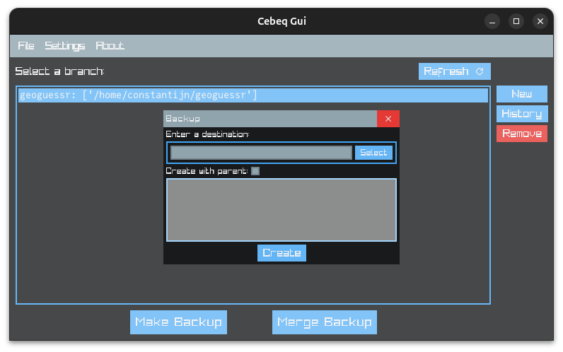

# cebeq

An incremental backup system written in C.
### Features
- full and incremental backups
- merging of incremental backups
- cli and gui applications

> [!WARNING]
> This project is still in development!

### Building
The intended build system is [nob.h](https://github.com/tsoding/nob.h).  
To bootstrap nob, simply run: `cc -o nob nob.c` or `make`.  
After that use `./nob` with a specified target to build the project.  
See `./nob --help` for more information.

### Third-Party libraries
- [cwalk](https://github.com/likle/cwalk) by likle, licensed under the MIT License.
- [nob.h](https://github.com/tsoding/nob.h) by tsoding, licensed under the Unlicense.
- [raylib](https://github.com/raysan5/raylib) by raysan5, licensed under the Zlib license.
- [clay](https://github.com/nicbarker/clay) by nicbarker, licensed under the Zlib license

### Dependencies

This project uses [raylib](https://github.com/raysan5/raylib) as a graphical backend. See their wiki for build instructions. 

Make sure to either place the compiled `.a` file into the `lib` directory or have it in your path.  
Alternatively, you can download a pre-built binaries from the [`release`](https://github.com/fietec/cebeq/releases) tab which also ship raylib.
